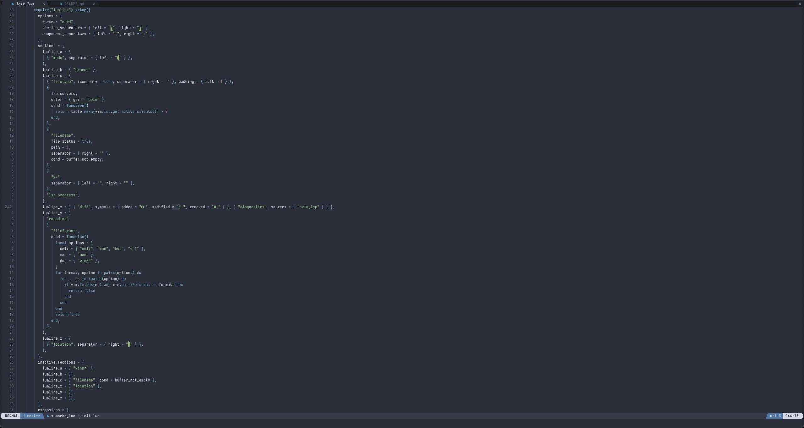

# Neovim dotfiles

Not much of use here yet, soon to be converted to fennel at which point will be documented.

## Usage

Clone to $XDG_CONFIG_HOME/nvim (usually ~/.config/nvim) and open nvim.

## Current TODO

- [x] Better initial setup (auto sync packages if missing)
- [ ] Move to fennel
- [ ] Add missing plugins and setup config for plugins
- [x] Finish porting .vim

## Issues

Lots
